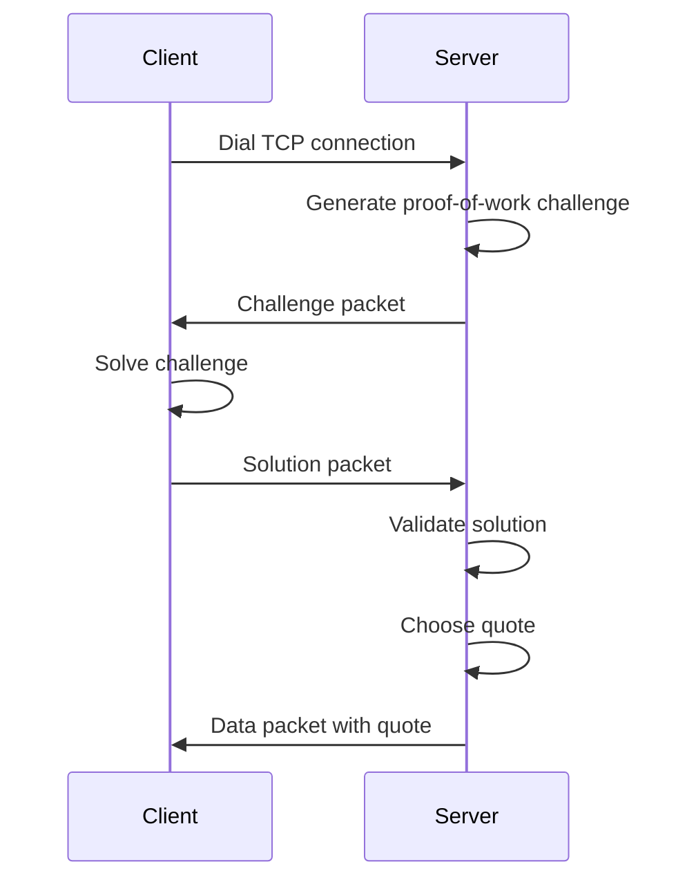

# powords


## Overview

Server main package can be found in [`cmd/server`](cmd/server) directory.
Client main package can be found in [`cmd/client`](cmd/client) directory.

To run server and client, you can use the following commands:

```
go run cmd/server/main.go
go run cmd/client/main.go
```


## Protocol



### Transport layer

Packet format: `header | data`

Header:
- 2 bytes: Packet length (little-endian) not including the header
- 1 byte: Packet type (0: challenge, 1: solution, 2: data response)

Data:
- N bytes: Packet data


Data part of the packet is different for each packet type:
- Challenge packet: `time | memory | key length | difficulty | threads`

### Proof-of-Work Challenge


## Configuration


### Server configuration

Environment Variables
- ADDR: The address the server will listen on. Default is localhost:2939.
- MAX_CONNS: The maximum number of concurrent connections the server will handle. Default is the number of CPU cores.
- POW_TIME: The time parameter for the proof-of-work challenge. Default is 1.
- POW_MEM: The memory parameter for the proof-of-work challenge. Default is 1.
- POW_KEY_LEN: The key length parameter for the proof-of-work challenge. Default is 1.
- POW_DIFFICULTY: The difficulty parameter for the proof-of-work challenge. Default is 1.
- POW_THREADS: The number of threads for the proof-of-work challenge. Default is 1.

#### Example
To run the server with custom configuration, you can set the environment variables before starting the application. For example:

```
export ADDR="0.0.0.0:8080"
export MAX_CONNS=100
export POW_TIME=2
export POW_MEM=1024
export POW_KEY_LEN=32
export POW_DIFFICULTY=5
export POW_THREADS=4
```

#### Configuration Validation
The configuration is validated at runtime. If any of the parameters are invalid (e.g., non-positive values for POW_TIME, POW_MEM, POW_KEY_LEN, POW_DIFFICULTY, or POW_THREADS), the application will panic with an appropriate error message.

#### Default Configuration
If no environment variables are set, the application will use the following default configuration:

```
ADDR: localhost:2939
MAX_CONNS: Number of CPU cores
POW_TIME: 1
POW_MEM: 1
POW_KEY_LEN: 1
POW_DIFFICULTY: 1
POW_THREADS: 1
```

This configuration is suitable for development and testing purposes. For production use, it is recommended to adjust these values according to your requirements.