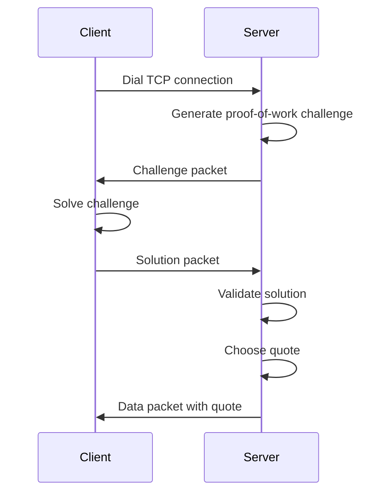

# powords


## Overview

This is a client-server application implementing a proof-of-work (PoW) system to serve quotes. 

Server main package can be found in [`cmd/server`](cmd/server) directory.
Client main package can be found in [`cmd/client`](cmd/client) directory.

To run server and client, you can use the following commands:

```
go run cmd/server/main.go
go run cmd/client/main.go
```


The project is written in Go and organized into several key components:

### Core Components

#### Transport Layer ([`internal/transport`](internal/transport))
- Implements the network protocol with three packet types: Challenge, Proof, and Data
- Provides packet encoding/decoding
- Handles TCP connections

#### Server ([`internal/server`](internal/server))
- Manages TCP connections and concurrent client handling
- Configurable through environment variables
- Uses connection pooling and timeout management

#### Challenger ([`internal/challenger`](internal/challenger))
- Implements the proof-of-work system using Argon2
- Generates challenges and verifies solutions
- Configurable difficulty levels

#### Client ([`internal/client`](internal/client))
- Connects to server
- Solves proof-of-work challenges
- Receives and displays quotes

#### Quotes System ([`internal/quotes`](internal/quotes))
- Manages programming quotes database
- Provides random quote selection


## Protocol



### Transport layer

### Packet Structure
Each packet consists of a header and a data section:

- Header: 3 bytes
  - Size (2 bytes): The size of the data section.
  - Kind (1 byte): The type of the packet.
- Data: Variable length, depending on the packet type.

### Packet Types
There are three types of packets:

- PacketChallenge: Used to send a challenge to the client.
- PacketProof: Used to send proof of work from the client.
- PacketData: Used to send arbitrary data.


#### PacketKind
The PacketKind is a byte that indicates the type of the packet. The possible values are:

- 0: PacketChallenge
- 1: PacketProof
- 2: PacketData

### Packet Format

#### PacketChallenge
- Kind: 0
- Data: Encoded DataChallenge structure.

#### PacketProof
- Kind: 1
- Data: Proof of work data (variable length).

#### PacketData
- Kind: 2
- Data: Arbitrary data (variable length).

#### DataChallenge Structure
The DataChallenge structure is used in PacketChallenge packets and has the following format:

- Time (4 bytes): Time parameter for the challenge.
- Memory (4 bytes): Memory parameter for the challenge.
- KeyLen (4 bytes): Key length parameter for the challenge.
- Difficulty (4 bytes): Difficulty parameter for the challenge - number of trailing zeros required in the hash.
- Threads (1 byte): Number of threads for the challenge.
- Salt (8 bytes): Random salt for the challenge.
- The total size of the DataChallenge structure is 29 bytes.

### Proof-of-Work Challenge

Argon2 hash function is used for the proof-of-work challenge. The parameters for the Argon2 function are configurable and can be set using environment variables. 

It was chosen because of following reasons:
- it's highly configurable, allowing us adjust difficulty beyond just the number of trailing zeros
- it's memory-hard, making it resistant to GPU and ASIC attacks
- as far as I know, it's considered SOTA for secure hashing, so it's resistant to known attacks

Server generates a random salt using the crypto/rand package.
It then encodes configurable challenge parameters (Time, Memory, KeyLen, Salt, Threads, Difficulty) into a DataChallenge packet and sends it to the client.

Difficulty is the minimum number of trailing zeros required in the hash. The client must compute a proof that satisfies this difficulty level by generating a proper zero-padded hash.

If client responds with a valid proof packet, server checks the proof by computing a hash using the Argon2 algorithm with the received data, the previously generated salt, and the challenge parameters. It then checks the number of trailing zeros in the hash using the trailingZeros function. If the number of trailing zeros is less than the required difficulty, it returns an error.

If the proof is valid, the server sends a Data packet with a quote to the client.

## Configuration

### Server configuration

Environment Variables
- ADDR: The address the server will listen on. Default is localhost:2939.
- METRICS_ADDR: The address for the Prometheus metrics server. Default is localhost:9090.
- MAX_CONNS: The maximum number of concurrent connections the server will handle. Default is the number of CPU cores.
- POW_TIME: The time parameter for the proof-of-work challenge. Default is 1.
- POW_MEM: The memory parameter for the proof-of-work challenge. Default is 1.
- POW_KEY_LEN: The key length parameter for the proof-of-work challenge. Default is 1.
- POW_DIFFICULTY: The difficulty parameter for the proof-of-work challenge. Default is 1.
- POW_THREADS: The number of threads for the proof-of-work challenge. Default is 1.

#### Example
To run the server with custom configuration, you can set the environment variables before starting the application. For example:

```
export ADDR="0.0.0.0:8080"
export METRICS_ADDR="localhost:9090"
export MAX_CONNS=100
export POW_TIME=2
export POW_MEM=1024
export POW_KEY_LEN=32
export POW_DIFFICULTY=5
export POW_THREADS=4
```

#### Configuration Validation
The configuration is validated at runtime. If any of the parameters are invalid (e.g., non-positive values for POW_TIME, POW_MEM, POW_KEY_LEN, POW_DIFFICULTY, or POW_THREADS), the application will panic with an appropriate error message.

#### Default Configuration
If no environment variables are set, the application will use the following default configuration:

```
ADDR: localhost:2939
METRICS_ADDR: localhost:9090
MAX_CONNS: Number of CPU cores
POW_TIME: 1
POW_MEM: 1
POW_KEY_LEN: 1
POW_DIFFICULTY: 1
POW_THREADS: 1
```

This configuration is suitable for development and testing purposes. For production use, it is recommended to adjust these values according to your requirements.